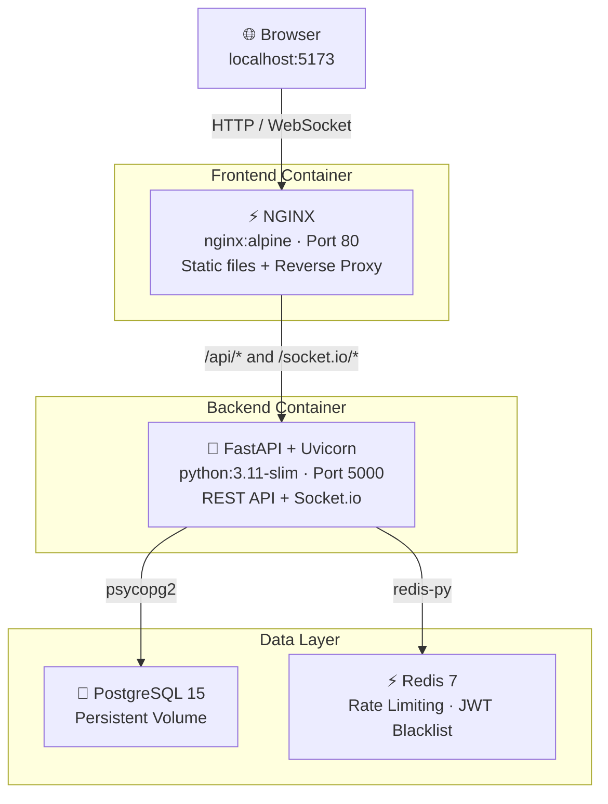

# VoteSecure — Production-Style Voting Platform

A full-stack online voting platform used as a **DevOps portfolio project** — containerized, proxied, and progressively evolved toward production-grade infrastructure.

> This repository tracks both the application and the infrastructure work built around it, documented phase by phase.

---

## Application Overview

VoteSecure is a multi-role voting platform where admins create and manage elections, and voters cast encrypted ballots with real-time results.

**Core capabilities:**
- Role-based access control (admin / voter)
- AES-256-CBC ballot encryption
- JWT authentication with refresh token rotation and token blacklisting
- Real-time vote results via WebSocket (Socket.io)
- Hash-chained, append-only audit trail
- Redis-based rate limiting (5 requests / 60s per IP)
- Election lifecycle state machine: `upcoming → active → closed`

---

## Architecture



**Single public entry point:** All traffic enters through NGINX on port 5173. The backend is internal-only — never exposed to the host.

---

## Technology Stack

| Layer | Technology |
|---|---|
| **Frontend** | React 18, Vite 5, React Router v6, TailwindCSS 3, Recharts, Socket.io Client |
| **Backend** | FastAPI, Python 3.11, python-socketio, psycopg2, PyJWT, passlib/bcrypt |
| **Database** | PostgreSQL 15 |
| **Cache** | Redis 7 |
| **Reverse Proxy** | NGINX (nginx:alpine) |
| **Containerization** | Docker, Docker Compose V2 |
| **Security** | AES-256-CBC, JWT blacklisting, RBAC, Redis rate limiting, SHA-256 audit chain |

---

## Quick Start

**Prerequisites:** Docker, Docker Compose V2

**Step 1 — Clone the repository**

```bash
git clone https://github.com/Vasanth1602/votesecure-devops-journey.git
cd votesecure-devops-journey
```

**Step 2 — Create the root `.env` file** *(Docker Compose reads this for the DB password)*

**Windows (PowerShell):**
```powershell
"DB_PASSWORD=your_strong_password_here" | Out-File .env -Encoding utf8
```

**Mac / Linux:**
```bash
echo "DB_PASSWORD=your_strong_password_here" > .env
```

**Step 3 — Create the backend environment file**

**Windows (PowerShell):**
```powershell
Copy-Item backend/.env.example backend/.env
```

**Mac / Linux:**
```bash
cp backend/.env.example backend/.env
```

Then open `backend/.env` and set:
- `DB_PASSWORD` — must match what you set in Step 2
- `JWT_ACCESS_SECRET` and `JWT_REFRESH_SECRET` — generate with `python -c "import secrets; print(secrets.token_hex(32))"`
- `ENCRYPTION_KEY` — must be exactly 32 characters
- `ADMIN_EMAIL` and `ADMIN_PASSWORD` — your admin login credentials

**Step 4 — Start all services** *(same on all platforms)*

```bash
docker compose up --build
```

**Access the application:**
- Frontend: http://localhost:5173
- Health check: http://localhost:5173/health

Default admin credentials are set via `ADMIN_EMAIL` and `ADMIN_PASSWORD` in `backend/.env`.

---

## DevOps Work

### Phase 1 — Containerization ✅

- Containerized frontend and backend services using Docker
- Multi-stage Docker build for frontend (Node.js build → nginx:alpine serve)
- Docker Compose V2 orchestration with 4 services and isolated networking
- Named volume (`pgdata`) for PostgreSQL data persistence across restarts
- Service health checks on PostgreSQL (`pg_isready`) and Redis (`redis-cli ping`)
- Startup dependency ordering via `condition: service_healthy` — eliminates backend crash loops
- Secret management via `env_file` and environment variable substitution (`${DB_PASSWORD}`)
- `.dockerignore` for both services — excludes `node_modules`, `__pycache__`, `.env`, logs
- `docker-compose.override.yml` for local dev port exposure — base compose has no host ports

→ [Full Docker documentation](docs/phase-01-docker.md)

---

### Phase 2 — Reverse Proxy ✅

- NGINX embedded in the frontend container via multi-stage Dockerfile
- REST API routing: `/api/*` proxied to backend via Docker internal DNS
- WebSocket routing: `/socket.io/*` with full HTTP Upgrade handshake
- React SPA routing: `try_files` fallback ensures deep links work on browser refresh
- Backend and Redis ports removed from host exposure — all traffic through NGINX
- Real IP forwarding via `X-Real-IP` and `X-Forwarded-For` headers

→ [Full NGINX documentation](docs/phase-02-nginx.md)

---

### Phase 3 — Continuous Integration ✅

- GitHub Actions CI pipeline with 5 sequential stages on every push to `main` and every PR
- Sequential fail-fast design: lint → validate → build → smoke test — cheapest checks first
- Backend linting with `ruff` — catches unused imports, undefined names, and style violations
- Frontend build validation with Vite — confirms JavaScript compiles cleanly before Docker build
- Backend and frontend Docker image builds verified on a clean runner (no local cache)
- Application smoke test: 3-check validation — health check, API auth gate (401), and login + DB connectivity (200 + accessToken)
- GitHub Secrets for secure CI environment configuration — credentials never hardcoded
- PR-based workflow validated: CI blocks merge on failure, `main` stays clean

→ [Full CI documentation](docs/phase-03-cicd.md)

---

## Key Engineering Outcomes

- Built a reproducible multi-container architecture that starts reliably from a single command
- Eliminated backend crash loops by implementing health-check-gated service startup ordering
- Routed all client traffic through a single NGINX entry point — backend never exposed to the host
- Enabled real-time WebSocket updates through an nginx proxy with correct HTTP Upgrade handling
- Separated environment configuration from source code using `env_file` and variable substitution
- Reduced Docker build context size by excluding `node_modules`, caches, and secrets via `.dockerignore`

---

## Operational Learnings

Alongside the infrastructure setup, I am simulating real-world failures to understand system behavior under failure conditions.

Areas being explored:
- Container startup race conditions and dependency ordering
- Service discovery failures (internal DNS vs localhost)
- Reverse proxy misconfiguration and debugging (502, 504, path rewriting)
- WebSocket routing and silent fallback behavior
- Redis dependency analysis — what degrades vs what breaks
- Data persistence and volume lifecycle

Failure simulations and root cause analyses are documented in [docs/incidents/](docs/incidents/).

---

## Documentation

| Document | Description |
|---|---|
| [docs/phase-01-docker.md](docs/phase-01-docker.md) | Containerization deep-dive: Dockerfiles, Compose, volumes, networking, health checks |
| [docs/phase-02-nginx.md](docs/phase-02-nginx.md) | NGINX deep-dive: proxy configuration, WebSocket routing, SPA routing |
| [docs/phase-03-cicd.md](docs/phase-03-cicd.md) | CI deep-dive: pipeline design, stages, smoke test, GitHub Secrets, PR workflow |
| [docs/incidents/](docs/incidents/) | Incident reports from operational failure simulations |

---

## Roadmap

**Completed**
- ✅ Containerization (Docker + Docker Compose)
- ✅ Reverse Proxy (NGINX)
- ✅ Operational failure simulations (3 incidents documented)
- ✅ Continuous Integration (GitHub Actions)

**Upcoming**
- Cloud deployment (AWS)
- Monitoring and alerting (Prometheus + Grafana)
- Load testing and scaling
- Kubernetes migration
- Centralized logging
